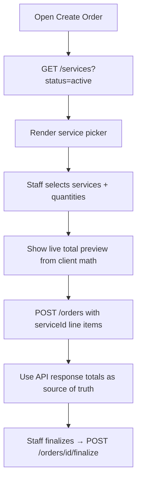

# Services ↔ Orders Integration — Frontend Dashboard Guide

> **Purpose:** Wire the rinsehq-dashboard order flow to the service catalog API so staff pick catalog services instead of typing prices manually.  
> **Backend status:** Implemented — orders resolve `serviceId` from `GET/POST /v1/services` and compute pricing server-side.  
> **Last updated:** July 2026

---

## Table of Contents

1. [What Changed on the Backend](#1-what-changed-on-the-backend)
2. [API Contract](#2-api-contract)
3. [Recommended UX Flow](#3-recommended-ux-flow)
4. [TypeScript Types & API Client](#4-typescript-types--api-client)
5. [Create / Edit Order UI](#5-create--edit-order-ui)
6. [Pricing Display](#6-pricing-display)
7. [Manual Line Items (Custom)](#7-manual-line-items-custom)
8. [Error Handling](#8-error-handling)
9. [File Checklist for Dashboard PR](#9-file-checklist-for-dashboard-pr)
10. [Testing Checklist](#10-testing-checklist)

---

## 1. What Changed on the Backend

### Before
- Order `lineItems` were **free-form** — frontend sent `name`, `unitPrice`, `amount` with no link to the catalog.
- `/v1/services` existed but orders ignored it.

### After
- Each line item can include **`serviceId`** referencing a catalog service (`SRV-...`).
- When `serviceId` is present, the API:
  - Loads the service from the store catalog
  - Validates it is **active**
  - Sets `name`, `unitPrice`, `laundryMode` from the catalog
  - Computes `amount = unitPrice × quantity`
  - Recomputes `subtotal`, `vat`, and `total` server-side
- On **finalize**, `ordersCount` on each used service is incremented.
- **Backward compatible:** line items without `serviceId` still work (custom/manual entries).

---

## 2. API Contract

### Load catalog (order form)

```
GET /v1/services?status=active
Authorization: Bearer {store_session_jwt}
Permission: orders OR services
```

**Response row:**

```json
{
  "id": "SRV-001",
  "name": "Wash & Fold",
  "category": "wash",
  "laundryMode": "Wash system",
  "unitPrice": 350000,
  "pricingUnit": "per_load",
  "turnaroundHours": 24,
  "status": "active",
  "description": "Default Wash & Fold service",
  "ordersCount": 12,
  "updatedAt": "2026-07-02T10:00:00"
}
```

All prices are in **kobo** (350000 = ₦3,500).

### Create order with catalog services

```
POST /v1/orders
Authorization: Bearer {store_session_jwt}

{
  "customer": {
    "name": "Jane Doe",
    "email": "jane@example.com",
    "phone": "+2348012345678",
    "address": "12 Main St"
  },
  "orderType": "drop-off",
  "laundryMode": "Wash system",
  "serviceTypeId": "optional-config-id",
  "discount": 0,
  "lineItems": [
    { "serviceId": "SRV-001", "quantity": 2 },
    { "serviceId": "SRV-002", "quantity": 1 }
  ]
}
```

**You do not need to send** `name`, `unitPrice`, or `amount` for catalog items — the API fills them in.

**Response line item:**

```json
{
  "serviceId": "SRV-001",
  "name": "Wash & Fold",
  "quantity": 2,
  "unitPrice": 350000,
  "amount": 700000,
  "laundryMode": "Wash system"
}
```

**Response order totals** (computed server-side):

```json
{
  "subtotal": 700000,
  "vat": 52500,
  "discount": 0,
  "total": 752500
}
```

### Update draft order line items

```
PATCH /v1/orders/{order_id}
Authorization: Bearer {store_session_jwt}

{
  "lineItems": [
    { "serviceId": "SRV-003", "quantity": 1 }
  ]
}
```

Only **draft** orders accept line item edits. Totals are recomputed on the server.

### Finalize (unchanged route, new side effect)

```
POST /v1/orders/{order_id}/finalize
```

Increments `ordersCount` on each service referenced in line items.

---

## 3. Recommended UX Flow



### Order form sections

1. **Customer** — unchanged
2. **Order type / pickup / delivery** — unchanged (`orderType`, `pickup`, `delivery`)
3. **Line items** — **replace free-text price inputs with service picker**
4. **Summary** — show `subtotal`, `vat`, `discount`, `total` from API response after save (or preview locally)

---

## 4. TypeScript Types & API Client

### Types

```typescript
export interface CatalogService {
  id: string;
  name: string;
  category: string;
  laundryMode: string;
  unitPrice: number; // kobo
  pricingUnit: string;
  turnaroundHours: number;
  status: "active" | "inactive";
  description: string;
  ordersCount: number;
  updatedAt: string;
}

export interface OrderLineItemInput {
  serviceId?: string;
  name?: string;
  quantity: number;
  unitPrice?: number;
  amount?: number;
  laundryMode?: string;
}

export interface OrderLineItem extends OrderLineItemInput {
  serviceId: string;
  name: string;
  unitPrice: number;
  amount: number;
}
```

### API functions

```typescript
const API_BASE = import.meta.env.VITE_API_BASE_URL;

export async function listActiveServices(token: string): Promise<CatalogService[]> {
  const res = await fetch(`${API_BASE}/services?status=active`, {
    headers: { Authorization: `Bearer ${token}` },
  });
  const body = await res.json();
  if (!res.ok || !body.success) throw new Error(body.error ?? "Failed to load services");
  return body.data;
}

export async function createOrder(
  token: string,
  payload: {
    customer: { name: string; email?: string; phone?: string; address?: string };
    orderType?: string;
    laundryMode?: string;
    serviceTypeId?: string;
    discount?: number;
    lineItems: OrderLineItemInput[];
    pickup?: { date: string; timeSlot: string };
    delivery?: { date: string; timeSlot: string };
    description?: string;
  }
) {
  const res = await fetch(`${API_BASE}/orders`, {
    method: "POST",
    headers: {
      Authorization: `Bearer ${token}`,
      "Content-Type": "application/json",
    },
    body: JSON.stringify(payload),
  });
  const body = await res.json();
  if (!res.ok || !body.success) throw new Error(body.error ?? "Failed to create order");
  return body.data;
}
```

---

## 5. Create / Edit Order UI

### Service picker component

```tsx
type SelectedLine = { serviceId: string; quantity: number };

function ServiceLinePicker({
  services,
  value,
  onChange,
}: {
  services: CatalogService[];
  value: SelectedLine[];
  onChange: (next: SelectedLine[]) => void;
}) {
  const addRow = () => onChange([...value, { serviceId: services[0]?.id ?? "", quantity: 1 }]);

  return (
    <div>
      {value.map((row, index) => (
        <div key={index} className="line-row">
          <select
            value={row.serviceId}
            onChange={(e) => {
              const next = [...value];
              next[index] = { ...row, serviceId: e.target.value };
              onChange(next);
            }}
          >
            {services.map((s) => (
              <option key={s.id} value={s.id}>
                {s.name} — {formatNgn(s.unitPrice)} / {s.pricingUnit}
              </option>
            ))}
          </select>
          <input
            type="number"
            min={1}
            value={row.quantity}
            onChange={(e) => {
              const next = [...value];
              next[index] = { ...row, quantity: Number(e.target.value) };
              onChange(next);
            }}
          />
          <button type="button" onClick={() => onChange(value.filter((_, i) => i !== index))}>
            Remove
          </button>
        </div>
      ))}
      <button type="button" onClick={addRow}>Add service</button>
    </div>
  );
}
```

### Submit handler

```typescript
async function handleCreateOrder() {
  setError(null);
  try {
    const services = await listActiveServices(sessionToken);
    if (lineItems.length === 0) {
      setError("Add at least one service");
      return;
    }

    const payload = {
      customer: { name: customerName, email: customerEmail, phone: customerPhone },
      orderType,
      discount,
      lineItems: lineItems.map((row) => ({
        serviceId: row.serviceId,
        quantity: row.quantity,
      })),
    };

    const data = await createOrder(sessionToken, payload);
    setOrder(data.order); // use data.order.subtotal, .vat, .total from API
    navigate(`/orders/${data.order.id}`);
  } catch (e) {
    setError(e instanceof Error ? e.message : "Could not create order");
  }
}
```

### On mount — load services

```typescript
useEffect(() => {
  listActiveServices(token)
    .then(setServices)
    .catch((e) => setError(e.message));
}, [token]);
```

Show empty state if `services.length === 0`:

> No active services. Add services in **Settings → Services** before creating orders.

Link to `/services` management page.

---

## 6. Pricing Display

### Client-side preview (optional, before save)

```typescript
function previewSubtotal(
  services: CatalogService[],
  lines: SelectedLine[]
): number {
  return lines.reduce((sum, line) => {
    const svc = services.find((s) => s.id === line.serviceId);
    return sum + (svc ? svc.unitPrice * line.quantity : 0);
  }, 0);
}

function previewTotal(subtotal: number, discount: number, vatRate = 7.5): number {
  const vat = Math.round(subtotal * vatRate / 100);
  return Math.max(subtotal + vat - discount, 0);
}
```

**After save**, always display totals from the API response — the server is the source of truth (VAT rate comes from backend config).

```typescript
function formatNgn(kobo: number): string {
  return new Intl.NumberFormat("en-NG", {
    style: "currency",
    currency: "NGN",
    minimumFractionDigits: 0,
  }).format(kobo / 100);
}
```

---

## 7. Manual Line Items (Custom)

For one-off charges not in the catalog, omit `serviceId` and send full fields:

```json
{
  "lineItems": [
    {
      "name": "Express rush fee",
      "quantity": 1,
      "unitPrice": 50000,
      "amount": 50000
    }
  ]
}
```

**UI pattern:** “Add custom item” toggle that shows name + price fields instead of the service dropdown.

You can mix catalog and custom items in one order:

```json
{
  "lineItems": [
    { "serviceId": "SRV-001", "quantity": 1 },
    { "name": "Stain treatment", "quantity": 1, "unitPrice": 150000, "amount": 150000 }
  ]
}
```

---

## 8. Error Handling

| API error | Cause | UI action |
|-----------|-------|-----------|
| `Service not found: SRV-...` | Stale picker after service deleted | Reload services, clear invalid selection |
| `Service is not active: ...` | Service deactivated after page load | Reload services, show warning |
| `At least one line item is required` | Empty line items array | Block submit |
| `Only draft orders can be edited` | Edit on finalized order | Disable edit UI |
| `Quantity must be greater than zero` | Invalid quantity | Validate min=1 on input |

Show API `error` string in a toast or inline alert — backend returns `{ success: false, error: "..." }`.

---

## 9. File Checklist for Dashboard PR

### New
- [ ] `src/lib/api/services.ts` — `listActiveServices`, types
- [ ] `src/components/orders/ServiceLinePicker.tsx`
- [ ] `src/components/orders/OrderTotalsSummary.tsx`

### Modify
- [ ] `src/pages/orders/CreateOrderPage.tsx` — load services, use `serviceId` line items
- [ ] `src/pages/orders/EditOrderPage.tsx` — same for draft edits
- [ ] `src/pages/orders/OrderDetailPage.tsx` — show `serviceId` / link to service name
- [ ] Remove hardcoded service names/prices from order form

### Unchanged
- [ ] Finalize flow, payment link, invoice pages
- [ ] `/services` CRUD management page (already exists or separate task)

---

## 10. Testing Checklist

```
□ GET /services?status=active returns store catalog
□ Create order with serviceId only (no manual prices) → 201
□ Response line item has correct name, unitPrice, amount, serviceId
□ Response total includes VAT
□ Finalize order → service ordersCount increments by 1
□ Deactivated service → create order returns 400
□ Custom line item without serviceId still works
□ Edit draft: replace line items with different serviceId → totals update
□ Cannot edit line items on pending/completed order
□ Empty line items → 400 on create
```

---

## Quick Reference

| Action | Endpoint |
|--------|----------|
| Load picker data | `GET /v1/services?status=active` |
| Create order | `POST /v1/orders` with `{ serviceId, quantity }` |
| Edit draft | `PATCH /v1/orders/{id}` with `lineItems` |
| Finalize | `POST /v1/orders/{id}/finalize` |
| Manage catalog | `GET/POST/PATCH /v1/services` |

---

*End of SERVICES_ORDERS_FRONTEND.md*
